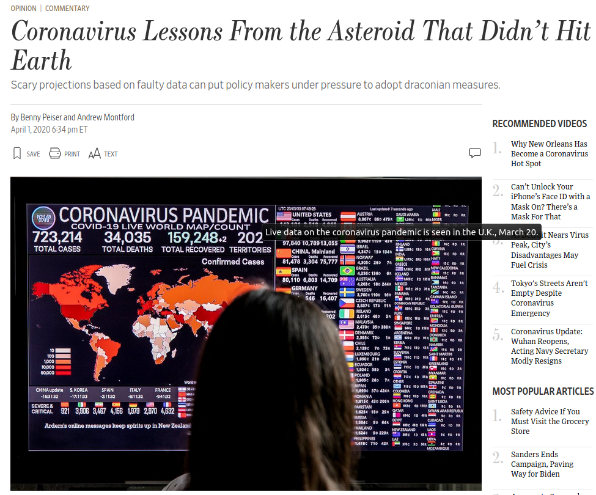
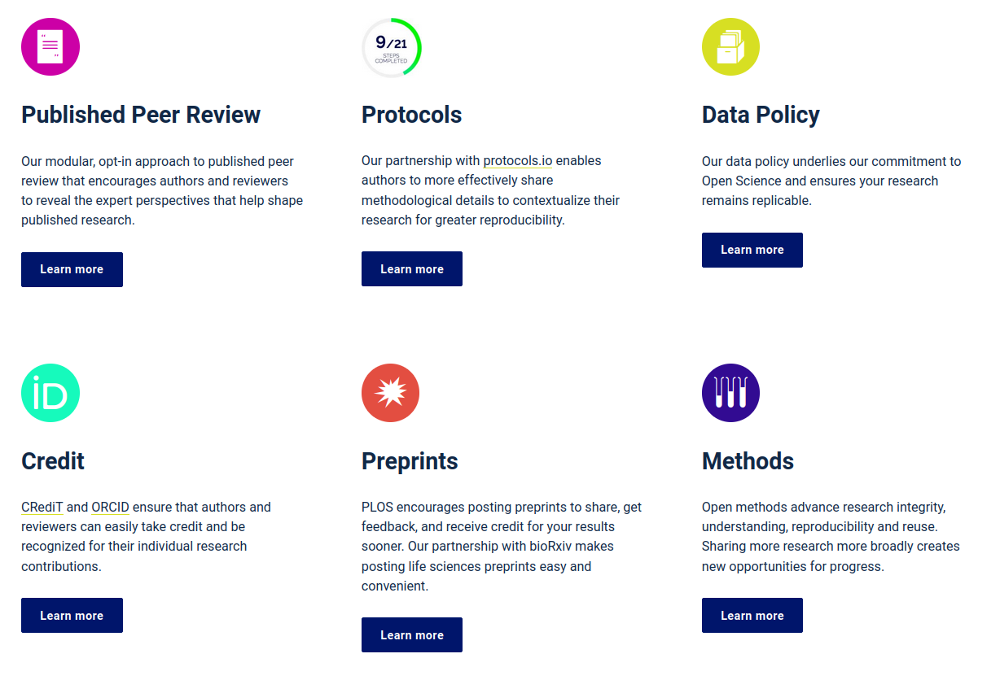
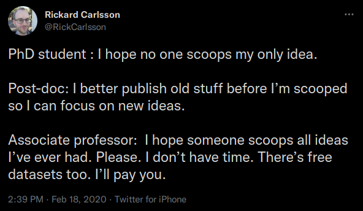
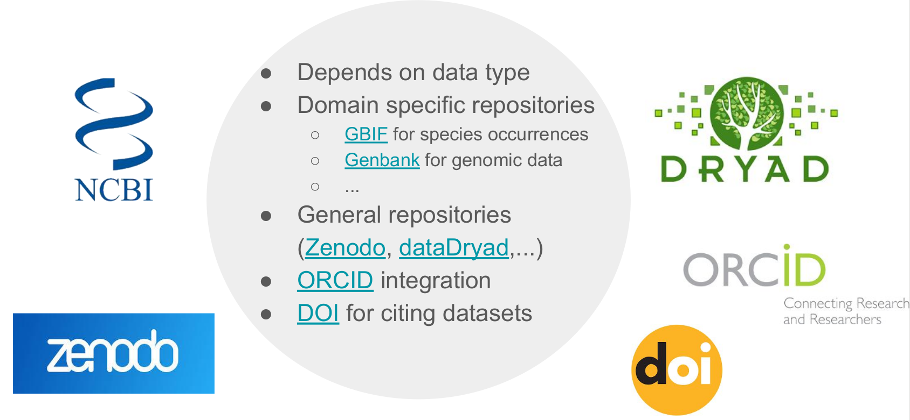

class: middle

**reproducible research** is the ability to recompute data analytic results, given an observed data set and knowledge of the data analysis pipeline.

.footnote[Peng 2015 [*The reproducibility crisis in science: A statistical counterattack*](https://doi.org/10.1111/j.1740-9713.2015.00827.x)]

???

# reproducible research

---
class: middle

**reproducibility for scientific reasons**

* increased trustworthiness
* more rigorous, reliable science
* learning more from one another's work

  
.footnote[Thompson 2018 [*The Life & Times of a Reproducible Clinical Project in R*](https://bit.ly/jlt-rmed2018)]

???

# repro for scientific reasons

---
class: middle

**reproducibility for personal reasons**

- helps researchers remember how and why they did *x*
- enables researchers to quickly and simply modify figures, tables, etc.
- enables quick reconfiguration of previously conducted research tasks

  
.footnote[Alson and Rick 2021 [*A Beginner\'s Guide to Conducting Reproducible Research*](https://doi.org/10.1002/bes2.1801)]

???

# repro for personal reasons

---
class: middle, center

.left-footnote[Ingraham 2016 [*An alarming number of scientific papers contain Excel errors*](https://www.washingtonpost.com/news/wonk/wp/2016/08/26/an-alarming-number-of-scientific-papers-contain-excel-errors/)]

???

# excel errors

---

.pull-left[
  
]

.pull-right[
"The climate scientists at the centre of a media storm over leaked emails were
yesterday cleared of accusations that they fudged their results and silenced
critics, but a review found they had failed to be open enough about their
work."
]

.footnote[Adam 2010 [*Climategate scientists cleared of manipulating data on global warming*](https://www.theguardian.com/environment/2010/jul/08/muir-russell-climategate-climate-science)]

???

# climategate

---

.pull-left[
  
]

.pull-right[
<small>
  Several researchers have apparently asked to see Imperial's calculations, but
  Prof. Neil Ferguson, the man leading the team, has said that <mark>the
  computer code is 13 years old and thousands of lines of it "undocumented,"
  making it hard for anyone to work with, let alone take it apart to identify
  potential errors</mark>. He has promised that it will be published in a week
  or so, but in the meantime reasonable people might wonder whether something
  made with 13-year-old, undocumented computer code should be used to justify
  shutting down the economy. Meanwhile, the authors of the Oxford model have
  promised that their code will be published "as soon as possible."
</small>
]

.footnote[Peiser and Montford 2020 [*Coronavirus Lessons From the Asteroid That Didn’t Hit Earth*](https://www.wsj.com/articles/coronavirus-lessons-from-the-asteroid-that-didnt-hit-earth-11585780465)]

???

# modeling covid fail

---
class: middle, inverse

Yet because open science can encompass all steps of the scientific process, it
is natural that it means different things to different people: One can open the
process of *data collection, data analysis, computer code, manuscript writing,
data publishing, and scholarly publication (to name a few)*. If you type “open
science” into a search engine, you would pull up thousands of hits that do any,
all, or none of these things. 

.footnote[Bahlai et al. 2019 [*Open Science Isn't Always Open to All Scientists*](https://doi.org/10.1511/2019.107.2.78)]

???

# open can mean many things

---
class: middle, center

.left-footnote[PLOS [*Transforming Scientific Communication through Open Science*](https://plos.org/open-science/?utm_medium=email&utm_source=internal&utm_campaign=inclusion&utm_content=inclusion)]

???

# plos open science

---
class: center, middle, inverse

</img>

.left-footnote[Peng 2011 [*Reproducible Research in Computational Science*](10.1126/science.1213847)]

???

# reproducibility spectrum

- including the code is important because it documents the decision-making process Powers and Hampton 2019

---
background-image: url('assets/figures/whypublish.png')
background-size: 90%

**why publish data**...

.footnote[Milotić 2018 [*Good enough practices in data management*](https://speakerdeck.com/milotictanja/good-enough-practices-in-data-management)]

???

# why publish data

* big picture
  + increasingly a requirement
  + advancement of science
  
* researcher perspective
  + papers with publicly available data receive a higher number of citations than similar studies lacking available data1
  + data sharing is associated with higher productivity
  + a citeable product
  

---

**concerns about sharing data, most of which can be addressed with metadata**

.pull-left[
.center[**concern**]

* inappropriate use due to misunderstanding of research purpose or parameters

* security and confidentiality of sensitive data

* lack of acknowledgement / credit

]

.pull-right[
.center[**solution**]

* provide rich abstract, purpose, use constraints, and supplemental information

* use constraints to specify who may access the data and how

* specify a required data citation within the use constraints

]

.footnote[[DataONE](https://www.dataone.org/education-modules)]

???

# general concerns

---
class: inverse, middle

Without clear instructions, many researchers struggle to avoid chaos in their
file structures, and so are understandably reluctant to expose their workflow
for others to see. This may be one of the reasons that so many requests for
details about method, including requests for data and code, are turned down or
go unanswered.

.footnote[Marwick et al. 2018 [*Packaging Data Analytical Work Reproducibly Using R (and Friends)*](https://doi.org/10.1080/00031305.2017.1375986)]

???

# ashamed of chaos

---
class: middle, center

???

# getting scooped

---
class: middle, center, inverse

# culture

---
background-image: url('assets/figures/fair.png')
background-size: 90%

.footnote[Milotić 2018 [*Good enough practices in data management*](https://speakerdeck.com/milotictanja/good-enough-practices-in-data-management)]

???

# FAIR

---

**where to publish data?**

 

data repository: long-term | versioned | citeable | discoverable

.center[
  
]

`r emo::ji("prohibited")`: Dropbox | Google Drive | LinkedIn | ResearchGate | websites | etc.

.footnote[Milotić 2018 [*Good enough practices in data management*](https://speakerdeck.com/milotictanja/good-enough-practices-in-data-management)]

???

# where to publish

---

**where to publish data?**

 
 
 

.center[
  
]

 

[re3data](https://www.re3data.org/) is awesome but I would start with...  
* institutional resources
* lab, colleagues
* conferences

???

# re3data

---
background-image: url("assets/figures/sortee_coding.png")
background-size: 90%

???

# sortee ~ code

---
class: inverse

**license**

 
 
 
 

...have a license file in the project's home directory that clearly states what license(s) apply to the project's software, data, and manuscripts. Lack of an explicit license does not mean there isn't one; rather, it implies the author is keeping all rights and others are not allowed to reuse or modify the material.] We recommend Creative Commons licenses for data and text, either CC-0 (the "No Rights Reserved" license) .light-grey[or CC-BY (the "Attribution" license, which permits sharing and reuse but requires people to give appropriate credit to the creators). For software, we recommend a permissive open source license such as the MIT, BSD, or Apache license...

.footnote[Wilson et al. 2017 [*Good enough practices in scientific computing*](https://doi.org/10.1371/journal.pcbi.1005510)]

???

# license

---
background-image: url("assets/figures/choosealicense.png")
background-size: 90%

 
 
 

.footnote[[choosealicense.com](https://choosealicense.com/)]

???

# license tool

---

**ORCiD**

 

.center[
  
]

.footnote[[orcid.org](https://orcid.org/)]

???

# ORCiD
